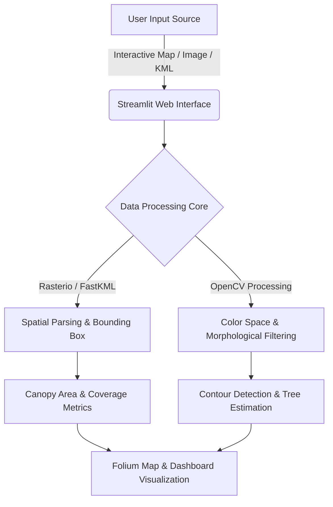

# Geospatial Tree Canopy & Automated Counter

> An interactive web application designed to compute tree canopy coverage and estimate individual tree counts using advanced computer vision (OpenCV) and geospatial mapping (Rasterio, Folium, and FastKML).

🌐 **Live Application:** [https://geospatial-tree-canopy-measure.streamlit.app/](https://geospatial-tree-canopy-measure.streamlit.app/)

---

## 🌟 Features

- **Interactive Region Selection:** Draw custom regions of interest (ROIs) directly on top of high-resolution map tiles using Folium.
- **Automated Canopy Extraction:** Process aerial or satellite imagery to isolate green canopy layers utilizing color thresholding and contour analysis.
- **Flexible Input Methods:** Support for live map coordinate bounds, direct image uploads (`.png`, `.jpg`), and custom boundary definitions via KML files.
- **Geospatial Processing:** Seamless handling of geospatial raster formats using Rasterio and spatial vector data extraction.

---

## 🏗️ System Architecture

The pipeline processes user inputs through multiple integrated layers, handling raster data, spatial indexing, and computer vision filters:



### 🛠️ Tech Stack

* **Frontend & Dashboard:** [Streamlit](https://streamlit.io/)
* **Computer Vision & Image Processing:** [OpenCV (`opencv-python-headless`)](https://opencv.org/)
* **Geospatial Raster & Vector Handling:** [Rasterio](https://github.com/mapbox/rasterio), [FastKML](https://fastkml.readthedocs.io/)
* **Interactive Mapping:** [Folium](https://python-visualization.github.io/folium/)

---

### 🚀 Local Installation & Setup

To run this repository locally on your machine, follow these steps:

**1. Clone the Repository:**
```bash
git clone [https://github.com/HIMA6768/geospatial-tree-canopy-measure-.git](https://github.com/HIMA6768/geospatial-tree-canopy-measure-.git)
cd geospatial-tree-canopy-measure-
```

**2. Install Dependencies:**

```bash
pip install -r requirements.txt
```
**3. Run the Streamlit App:**

```bash
streamlit run app.py
```
### 📁 Project Structure

```text
geospatial-tree-canopy-measure-/
├── app.py                # Main Streamlit application and core logic
├── requirements.txt      # Production Python dependencies
├── assets/               # Sample imagery, KML files, and test assets
└── README.md             # Project documentation
```
### 📜 License
This project is open-source and available under the terms of the MIT License.
